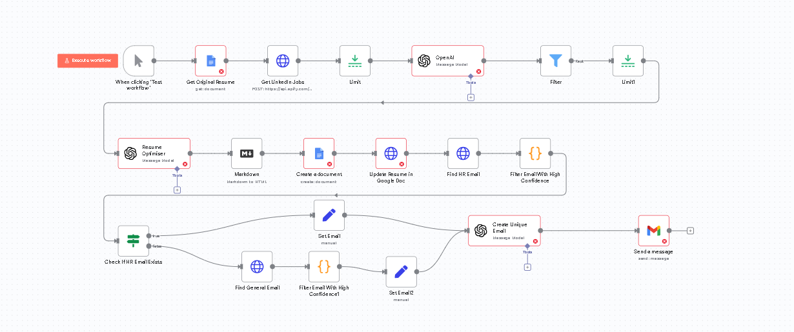

# n8n Workflow: Automated Job Application Assistant

This repository contains an n8n workflow that automates the process of finding relevant job postings, tailoring a resume for each, and sending a personalized application email.

## Overview

The workflow is designed to streamline the job search process by:
1.  Scraping job listings from LinkedIn based on specific keywords.
2.  Filtering jobs to identify the most relevant opportunities.
3.  Dynamically rewriting a master resume to match the job description.
4.  Finding the HR or a general company email address.
5.  Crafting and sending a unique application email with the tailored resume.

## How It Works

The workflow is composed of several connected nodes, each performing a specific task:

1.  **Manual Trigger**: Starts the workflow.
2.  **Get Original Resume**: Fetches the master resume from a Google Doc.
3.  **Get LinkedIn Jobs**: Scrapes LinkedIn for job postings using an Apify actor.
4.  **Limit**: Limits the number of jobs to process to avoid excessive runs.
5.  **OpenAI (Job Filter)**: Uses GPT-4 to analyze the job description and determine if it's relevant based on predefined skills.
6.  **Filter**: Proceeds only with jobs that are marked as relevant.
7.  **Resume Optimiser (OpenAI)**: If the job is relevant, this node rewrites the master resume to highlight skills and experience that match the job description.
8.  **Markdown to HTML**: Converts the optimized resume from Markdown to HTML.
9.  **Create & Update Google Doc**: Creates a new Google Doc with the tailored resume for the specific company and updates it.
10. **Find HR/General Email (Hunter.io)**: Tries to find an HR email address for the company. If not found, it searches for a generic company email.
11. **Create Unique Email (OpenAI)**: Drafts a personalized and compelling job application email.
12. **Send Email**: Sends the generated email via Gmail to the found address, with the link to the tailored resume.

## Setup

To use this workflow, you need to configure a few things:

1.  **n8n**: Make sure you have a running n8n instance. You can import the `workflow.json` file into your n8n workspace.
2.  **Credentials**: You will need to add credentials in n8n for:
    *   Google (for Google Docs & Gmail)
    *   OpenAI
3.  **API Keys & Tokens**: Update the following nodes with your personal API keys or tokens:
    *   **Get LinkedIn Jobs**: Replace `addyourtokenhere` with your Apify API token.
    *   **Find HR Email** & **Find General Email**: Replace `addyourapikeyhere` with your Hunter.io API key.
4.  **Customize**:
    *   **Get Original Resume**: Update the `documentURL` with the ID of your own master resume Google Doc.
    *   **Get LinkedIn Jobs**: Change the search URL to match your desired job title and location.
    *   **OpenAI (Job Filter)**: Modify the `User Skills` in the prompt to match your own skills.
    *   **Create a document**: Change the `folderId` to the Google Drive folder where you want to save the tailored resumes.
